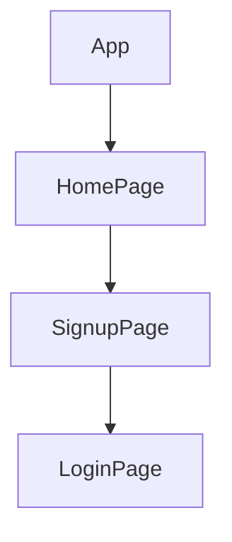

# TBW
> 💻 PROJECT NAME ✨ => 💻 # React + Node.js Authentication App

> 
<br>

[](https://tbw.vercel.app/)
[](https://tbw-85m5.vercel.app/)


## 🔗 Profile Links✨


| Resume | Github                                                                                                                                   | Linkedin                                                                                                                                                            | Portfolio                                                                                                                                    | Blogger                                                                                                                                                           | Medium                                                                                                                                    |
| ------------- | ---------------------------------------------------------------------------------------------------------------------------------------- | ------------------------------------------------------------------------------------------------------------------------------------------------------------------- | -------------------------------------------------------------------------------------------------------------------------------------------- | -------------------------------------------------------------------------------------------------------------------------------------------- | -------------------------------------------------------------------------------------------------------------------------------------------- |
| [](https://drive.google.com/file/d/1YE62u2ChjmlR-EKeqZ75UvFMg_KcY86T/view?usp=sharing) | [](https://github.com/shikhu51197/)| [](https://www.linkedin.com/in/shikha-gupta-12a2b5199) |[](https://shikhu51197.github.io/) |[](https://wwwartificial-intelligence.blogspot.com/) |[](https://medium.com/@sg780060) |  


## 💫Tech-Stack->

- #### For Frontend:-
   - `HTML5`
  - `CSS3`
  - `JavaScript `
  - `ReactJS`
  - `Redux`
    - #### For Backend:-
   - `NodeJS`
   - `ExpressJS`
    - `MongoDB `
- #### For deploy database:- 
    
     - `Vercel`
   
- #### For Styling:-  
   - `Chakra UI `
  
- #### For live Project: -
   - `Vercel`
   

## ⭕Steps to run our project:

✨Clone the repository.

✨Run the command `npm install` in both the frontend and backend folders.

✨Run the command `npm run server` in the backend folder.

✨Run the command `npm start` in the frontend folder on localhost:3000.

---
## Features ✨:-
---
 | Serial No            | Feature                                                              |
| ----------------- | ------------------------
| 1 | User login,  upload profile page|
| 2 | Home Page Design, responsive design |
| 3 |Create Project, Show Project list  |
| 4 | Upload Project, Edit & delete Project|
| 5 | Dashboard page general & display  |


---
# Package.json(Dependency)✨:-

 | Serial No            | Backend                      |  Frontend      |
| ----------------- | ---------------------|------------------------ |
| 1 | nodemon | Chakra-ui |
| 2 | mongoose | React Router dom |
| 3 | cors | redux , react-icons |
| 4 | dotenv | react-redux , react-thunk |
| 5 | express | react-hot-toast |


⭕Steps to use our project:


This project demonstrates a simple authentication system using JWT tokens with a Node.js backend and a React.js frontend.


---✨Getting Started:

✨Initialize the Application: To begin using the application, navigate to the frontend terminal and execute the command npm start. This will start the application locally, making it accessible through your web browser at port 3000.

✨Home Page: Upon launching the application, users are greeted with the home page, offering essential options for interaction like the Signup login .

---✨User Journey:

💫Login: Users are provided with the choice to log in. This initial step ensures a personalized experience within the application.


---

## Flow



---


<h1 align="center">✨Thank You✨</h1>


## Features

- User signup with name, username, email, phone, and password.
- Unique email validation during signup.
- User login with JWT token generation.
- Basic UI for signup and login forms.
- Frontend hosted on Vercel.

## Getting Started

### Prerequisites

- Node.js and npm installed
- MongoDB installed (for local development)

### Installation

1. **Clone the repository:**

   ```bash
   git clone https://github.com/yourusername/react-node-auth.git
   cd react-node-auth
Install dependencies for both backend and frontend:

bash
Copy code
cd backend
npm install
cd ../frontend
npm install
Run the development servers:

Backend:


cd backend
npm start

Frontend:


cd frontend
npm start
Open your browser and visit http://localhost:3000 to see the app in action.
Configuration
Explain any configuration steps if needed, such as setting up environment variables or configuration files.

Usage
Describe how to use the application, including key features and usage examples.

Form Validation
Explain the rules and requirements for form validation in your application.

Error Messages
Provide a list of possible form validation errors and their corresponding error messages.

Invalid Email Format:

Message: "Please enter a valid email address."
Invalid Password:

Message: "Password must be at least 8 characters long and include at least one lowercase letter, one uppercase letter, and one digit."
Invalid Phone Format:

Message: "Please enter a valid 10-digit phone number."
User Already Exists:

Message: "An account with this email address already exists. Please use a different email."
Server Error:

Message: "Something went wrong on our end. Please try again later."
Configuration
Update the MongoDB connection details in backend/server.js.
Customize JWT secret in backend/server.js.
Backend (Node.js)
The backend is a Node.js server using Express, MongoDB for data storage, bcrypt for password hashing, and JSON Web Tokens (JWT) for authentication.

Endpoints:
/signup: User signup with validation.
/login: User login with JWT token generation.
Frontend (React.js)
The frontend is a React.js application with simple components for signup and login.

Components:
Signup.js: User signup form.
Login.js: User login form.
Hosting on Vercel
Build the React app:


cd frontend
npm run build
Install Vercel CLI:


npm install -g vercel
Deploy to Vercel:


cd frontend
vercel
Follow the prompts to deploy your application.

Contributing
Contributions are welcome! Please follow the standard guidelines for contributing.

